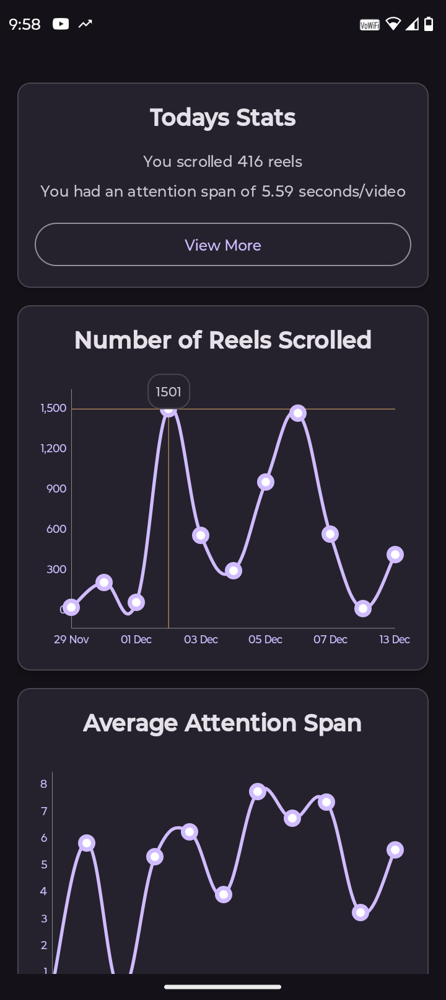
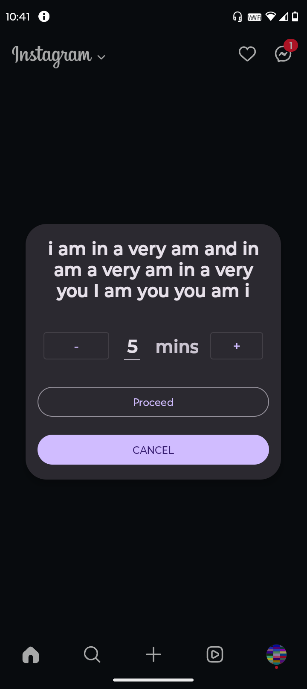
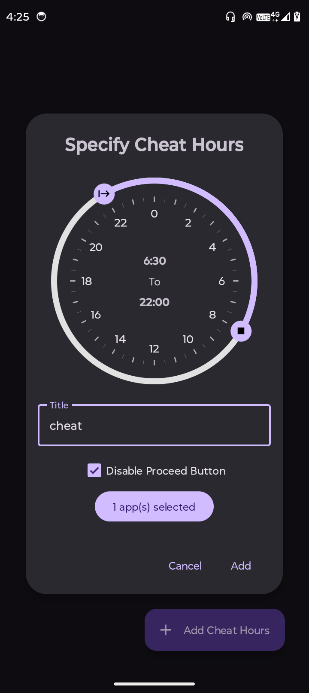
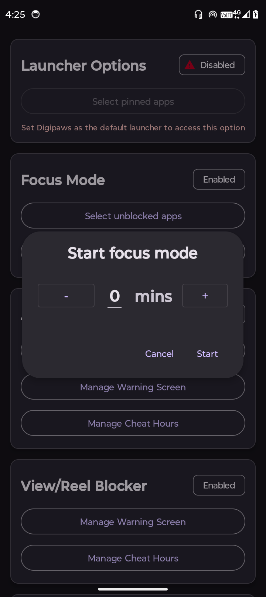
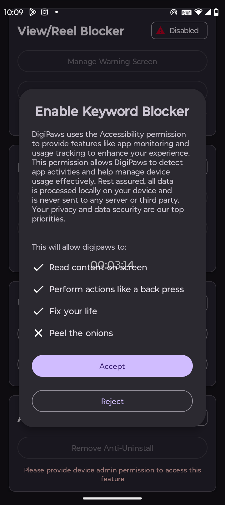
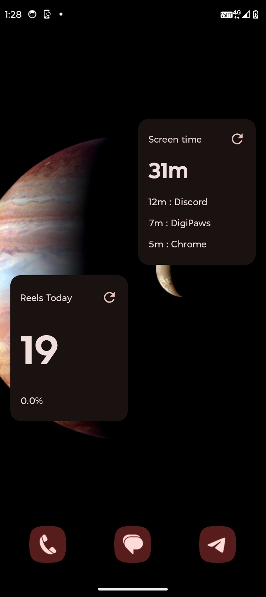
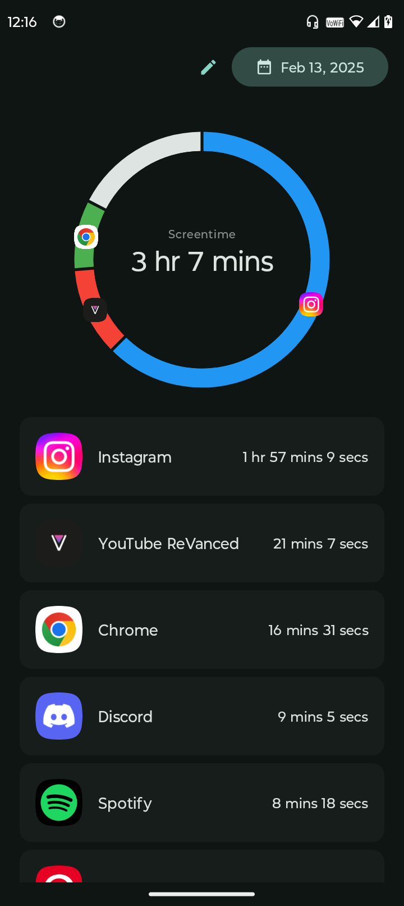
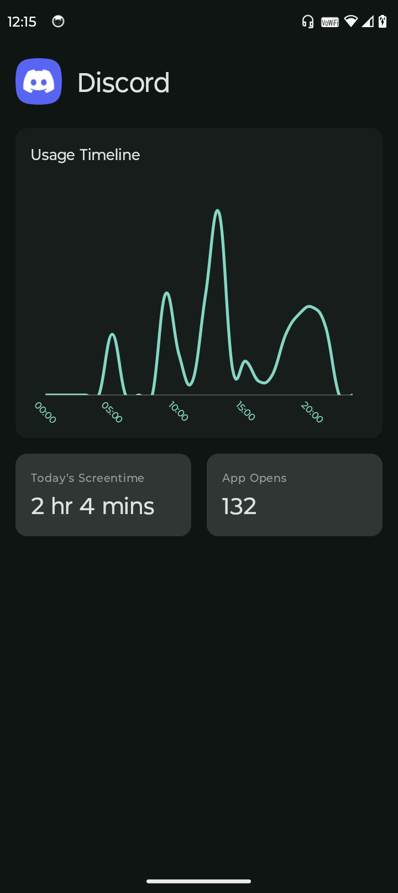

<div align="center">
  
   <h2>HMD</h2>
   
   [](https://github.com/nethical6/digipaws/graphs/contributors)
   [](https://discord.com/invite/Vs9mwUtuCN)
   [](https://t.me/digipaws6)
   [](https://github.com/nethical6/digipaws/releases)
   [](https://github.com/nethical6/digipaws)

</div>

<div align="center">
<a href="https://f-droid.org/packages/nethical.digipaws/">
    
</a>
</div>
HMD is an open-source Android productivity utility designed to help users reduce screen addiction by regulating app usage through a gamified experience. The application offers two modes namely the Base mode and the Gamified mode

> [!CAUTION]
> This project is experimental and not yet ready for full production. [Donate](https://digipaws.life/donate)

> [!CAUTION]
> HMD was recently removed from the Play Store for an unknown reason that Google refuses to
> disclose or discuss upon. "We didn't like your app restricting screen usage, so go fuck yourself"
> type shi

## Features

- **Gamified Challenges**: Earn coins, perform quests and more!
- **Open Source**: Fully transparent and free to use, with the source code available for community contributions.
- **Productivity Enhancement**: Helps build healthier digital habits and reduce screen addiction.
- **Versatile Blockers**: Take control of your digital environment by blocking apps, keywords, and unwanted in-app screens (e.g., YouTube shorts, comments).
- **Widgets** : Add stats to your homescreen
- **App Usage Stats** : Display Your stats
## Screenshots
Click on any image to enlarge it.
<table>
	<tr>
		<td></td>
		<td></td>
		<td></td>
		<td></td>
		<td></td>
		<td></td>
		<td></td>
		<td></td>
	</tr>
</table>


## ToDo
- [x] Block reels
- [x] Block comments
- [x] Block explicit context
- [x] App blockers
- [x] Focus Mode
- [x] Turn selected apps black and white to make them boring
- [x] Show time elapsed using an app on the centre of the screen
- [x] Anti-Uninstall
- [x] Customisable warning screen
- [x] Track App Usage Stats
- [x] Homescreen widgets
- [x] track how many tiktoks you scroll everyday 
- [ ] track attention span
- [ ] Quests and gamified mode
- [ ] Api for other developers to transform their existing apps into HMD quests!
- [ ] Geoblocker (basically block things when a certain area is entered, like workplace)
- [x] Block custom user defined keywords
- [x] redirect to a different website when a blocked keyword is found
- [ ] Modular and downloadable view blockers
- [ ] expand the app to ios and desktop.

## Modes

### Base Mode (✅)

Allows user to configure everything as they desire according to their own needs.

### Gamified Mode (🚧🔨)

This Mode introduces a gamified experience to control screen time using various fun elements like
quests and goals. This mode tracks your usage and configures everything accordingly as the days pass
by.
> [!CAUTION]
> This mode is being separately being developed as an individual app now.

## Configuring

1. Launch HMD on your Android device.
2. Provide all necessary permissions like Accessibility service, Notification, Draw over other apps etc
3. On Android 13+ devices, you need to additionally allow restricted settings before enabling the accessibility permission. Watch a tutorial [here](https://youtu.be/91B72lEpcqc?si=PCKKUSwM1aLdELqJ)
4. Configure the apps and views you want to block and set your preferences.
5. Start using your device with HMD managing your screen time.


> [!TIP]  
> This app relies exclusively on accessibility services to function. Because it requires sensitive permissions, please avoid downloading it from untrusted sources.

## Contributing

We welcome contributions from the community! If you'd like to contribute, please follow these steps:

1. Fork the repository.
2. Create a new branch for your feature or bugfix.
    ```sh
    git checkout -b feature/your-feature-name
    ```
3. Commit your changes.
    ```sh
    git commit -m "Add some feature"
    ```
4. Push to the branch.
    ```sh
    git push origin feature/your-feature-name
    ```
5. Create a new Pull Request.

Please ensure your code adheres to our coding standards and includes relevant tests.

Developing codes for accessibility services and blockers can be exceptionally complex and challenging to understand. This is primarily because blocking mechanisms must account for various app types, each functioning differently. Discovering these mechanisms has often required extensive app-specific debugging, coupled with trial-and-error approaches.


## Thanks
- [Usage Direct](https://codeberg.org/fynngodau/usageDirect): I had an extremely tough time figuring out and fixing the app usage stats. Extremely thanks to this app for saving me.
- [ShizuTools](https://github.com/legendsayantan/ShizuTools): [ShizukuRunner.kt](https://github.com/nethical6/digipaws/blob/kt-rewrite/app/src/main/java/nethical/digipaws/utils/ShizukuRunner.kt) has been derived from this project
- [MPAndroidChart](https://github.com/PhilJay/MPAndroidChart): All charts and graphs were made using this library

## License

HMD is licensed under the [GPL 3 or later licence](LICENSE). You are free to use, modify, and distribute this software in accordance with the license.

## Contact

For questions, suggestions, or feedback, please open an issue on the [GitHub repository](https://github.com/nethical6/digipaws/issues) or contact me at:
1. Discord: @nethical
2. Telegram: @nethicalps

## Common Questions

### Q: Is HMD safe?

**A:** Yes, way safer than any closed source app blocker on play-store.

### Q: Does it steal my data?

**A:** No. In fact it doesn't even need the INTERNET permission to run

### Q: I am unable to turn on accessibility settings. It says to enable "Restricted Settings"

**A:** Try downloading the app directly from fdroid app, instead of an .apk file. Read more on this
forum -> https://forum.f-droid.org/t/cant-activate-permissions-for-digipaws-on-android-14/30539


---

Thank you for using HMD! Together, we can create healthier digital habits.
